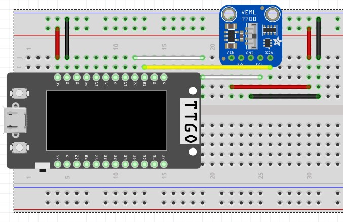

# _VEML7700 Light Sensor driver for ESP-IDF_
[](https://www.codefactor.io/repository/github/kgrozdanovski/veml7700-esp-idf)

## Overview

This project aims to provide a very simple interface for configuring and reading
data from the VEML7700 light sensor through the ESP-IDF framework.

As of the time of writing, version 1 supports reading both ALS and White light
levels, as well as an optional auto-configuration algorithm which makes sure
you are always reading with optimal sensor resolution and using the entire range.

Features not yet supported, but are planned for implementation in the future, include interrupts support and taking advantage of the different sleep modes
provided by the sensor IC itself.

The functionalities already implemented take complete advantage of the superior
accuracy of this sensor, hence you may use it for the broad range of applications
which would require a light level sensor.

## How to use example

### Hardware Required

To use this driver and run the example you must connect your ESP32 device to a VEML7700 sensor board. The default configuration requires the following wiring diagram:



This driver and the provided example should be able to run on any commonly available ESP32 development board, however 
as of the time of writing it has only been tested on an unofficial copy of the LilyGO TTGO T Display board.

If you have successfully tested this driver on another board please let me know and I will maintain a list of support
boards in this section.

### Configure the project

Currently the project does not rely on nor does it support any sdkconfig parameters however it is planned for the future e.g. for configuring I2C master device number etc.

By default the project uses `I2C_NUM_0` (`0x00`) as the I2C master device number unless otherwise defined by the user.

### Build and Flash

Build the project and flash it to the board as you would any other project, then run monitor tool to view the serial output:

```
idf.py -p PORT flash monitor
```

_(Replace PORT with the name of the serial port to use.)_

See the [Getting Started Guide](https://docs.espressif.com/projects/esp-idf/en/v4.3.1/esp32/get-started/index.html) for full steps to configure and use ESP-IDF to build projects.

## Example Output

If you have successfully built and flashed the example to your board then you should expect to see serial output simillar to this:

```
VEML7700 measured ALS 65.8944 lux or 6.1218 fc 
VEML7700 measured White 43.7760 lux or 4.0669 fc
```

## Troubleshooting

Make sure all your connections to the sensor are secured and the ground of both devices is properly connected.

For debugging the communication with the sensor, a logic analyzer is strongly recommended.

Alternatively, you may flash a tool such as [i2c_tools](https://github.com/espressif/esp-idf/tree/master/examples/peripherals/i2c/i2c_tools) to debug and scan your I2C bus.

## Contributors

Special thanks to [Jeroem Domburg](https://github.com/Spritetm) for his contributions and advice as well as the overall project review.
